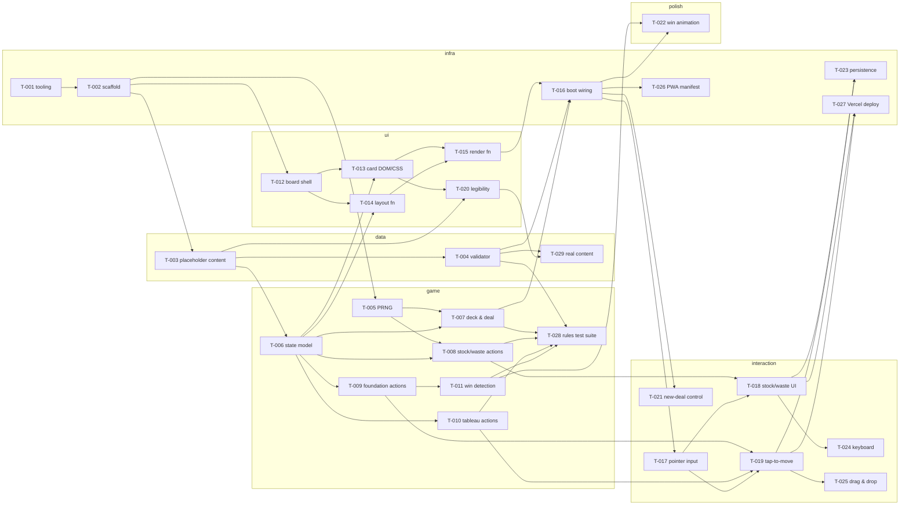

# Backlog

One file per work item, named `<id>-<slug>.md` (e.g. `T-007-tap-to-move.md`).

Rules live in [CLAUDE.md](../CLAUDE.md#backlog-system). This file is the index: keep the status
table, the dependency graph, and the critical path current whenever an item is added or changes
status.

## Ticket template

```markdown
---
id: T-007
title: Tap-to-move routing
status: blocked # blocked | ready | in-progress | done | icebox
depends_on: [T-003, T-005]
blocks: [T-011]
estimate: M # S | M | L
area: interaction # data | state | layout | interaction | polish | infra | idea
---

## Goal

One sentence on what this delivers.

## Context

Why this exists, and which part of the spec it implements.

## Acceptance criteria

- [ ] Specific, verifiable statements — someone else can confirm completion without asking you.

## Notes

Gotchas, pointers, constraints.
```

## Status

| ID    | Title                                                | Status  | Area        | Depends on                        |
| ----- | ---------------------------------------------------- | ------- | ----------- | --------------------------------- |
| T-001 | Tooling setup — Vite, TS strict, ESLint, Vitest      | done    | infra       | —                                 |
| T-002 | Directory scaffold and HTML shell                    | done    | infra       | T-001                             |
| T-003 | Placeholder content set                              | done    | data        | T-002                             |
| T-004 | Content validator                                    | done    | data        | T-003                             |
| T-005 | Seeded PRNG and shuffle                              | done    | state       | T-002                             |
| T-006 | State model and core types                           | done    | state       | T-003                             |
| T-007 | Deck construction and deal algorithm                 | ready   | state       | T-005, T-006                      |
| T-008 | Stock/waste actions — draw and reshuffle-recycle     | ready   | state       | T-005, T-006                      |
| T-009 | Foundation actions — open, file, complete, release   | ready   | state       | T-006                             |
| T-010 | Tableau actions — reveal, empty-column move          | ready   | state       | T-006                             |
| T-011 | Win detection                                        | blocked | state       | T-009                             |
| T-012 | Board shell — regions, sizing, responsive fit        | done    | layout      | T-002                             |
| T-013 | Card DOM structure and CSS, including the flip       | ready   | layout      | T-006, T-012                      |
| T-014 | layout(state) — piles to pixel positions             | ready   | layout      | T-006, T-012                      |
| T-015 | render(state) — full, idempotent DOM writes          | blocked | layout      | T-013, T-014                      |
| T-016 | Boot wiring — validate, seed, deal, first paint      | blocked | infra       | T-004, T-007, T-015               |
| T-017 | Pointer input layer and tap detection                | blocked | interaction | T-016                             |
| T-018 | Stock and waste interaction                          | blocked | interaction | T-008, T-017                      |
| T-019 | Tap-to-move routing and invalid-move feedback        | blocked | interaction | T-009, T-010, T-017               |
| T-020 | Card text legibility at ~48px width                  | blocked | layout      | T-003, T-013                      |
| T-021 | New-deal and settings control                        | blocked | interaction | T-016                             |
| T-022 | Win animation — canvas overlay                       | blocked | polish      | T-011, T-016                      |
| T-023 | localStorage persistence with payload validation     | blocked | infra       | T-018, T-019                      |
| T-024 | Desktop keyboard support                             | blocked | interaction | T-018                             |
| T-025 | Drag-and-drop enhancement                            | blocked | interaction | T-019                             |
| T-026 | PWA manifest and icons                               | blocked | infra       | T-016                             |
| T-027 | Vercel deployment                                    | blocked | infra       | T-018, T-019                      |
| T-028 | Rules and validator test suite                       | blocked | state       | T-004, T-007, T-008, T-010, T-011 |
| T-029 | Real content authoring                               | blocked | data        | T-004, T-020                      |

## Dependency graph

Edges point from a ticket to the tickets it unblocks. The `game` subgraph has no incoming edge
from `ui` or `interaction` — game logic never depends on the UI, by architectural invariant.



## Critical path

The vertical slice (deal → draw from stock → file a card to a foundation) is complete when
T-018 and T-019 land. The longest chain to it:

**T-001 → T-002 → T-003 → T-006 → T-013 → T-015 → T-016 → T-017 → T-018 / T-019**

(T-014 runs at the same depth as T-013; T-012 sits before both; the game-logic chain
T-005/T-007–T-010 runs in parallel and is shorter, feeding T-016 and T-018/T-019.)

Beyond the slice, the longest chains to ship extend that path by one step each:
**→ T-023 (persistence)**, **→ T-025 (drag & drop)**, or **→ T-027 (deploy)** — all at depth 10.
Everything else (T-020/T-029 content, T-021, T-022, T-024, T-026, T-028) hangs off earlier
nodes and parallelizes freely. Deploying (T-027) immediately after the slice is recommended so
real-device testing starts early.
